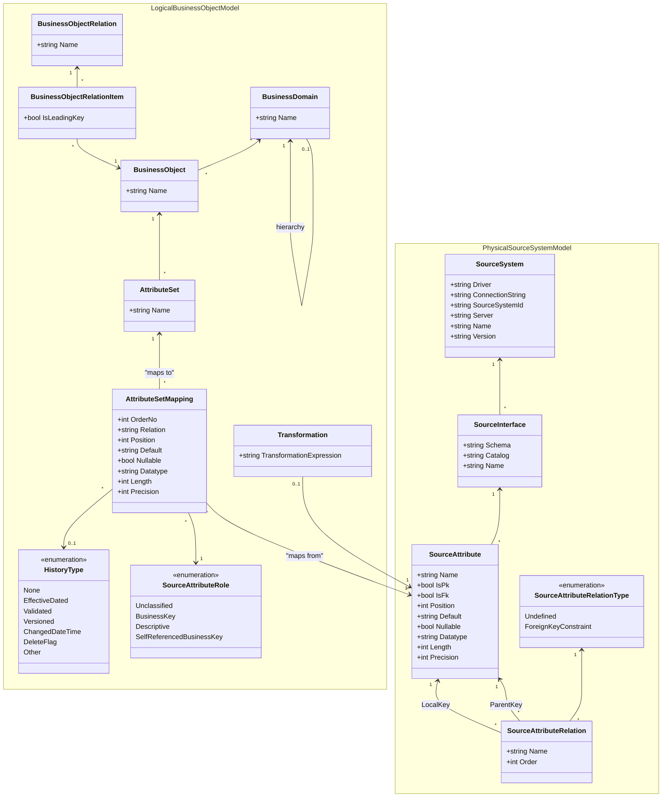

# DataSettMetamodel

The DataSettMetamodel project contains the core data models for the DataSett system, providing a comprehensive metamodel for business objects and their relationships to physical source systems.

## Overview

This project defines two main model categories:

1. **Logical Business Object Model** - Represents business concepts and their relationships
2. **Physical Source System Model** - Represents the actual data sources and their structure

## Architecture

### Base/DTO/Domain Pattern

The metamodel implements a clean separation pattern with three layers for each entity:

- **Base Classes** (`[EntityName]Base`) - Contain only scalar/context properties (Id, Name, timestamps, etc.)
- **DTO Classes** (`[EntityName]DTO`) - Inherit from base and add foreign key references for serialization
- **Domain Classes** (`[EntityName]`) - Inherit from base and add navigation properties and business logic

**Benefits:**
- Clean serialization to separate JSON files with ID references
- Clear separation of concerns
- Easy to test and maintain
- Supports complex object graphs without circular reference issues

**For detailed documentation, see:** [BASE_DTO_DOMAIN_PATTERN.md](BASE_DTO_DOMAIN_PATTERN.md)

### Layered Architecture

The metamodel follows a layered architecture where business concepts are mapped to physical data sources through attribute set mappings, enabling data integration and transformation scenarios.

## Class Structure



## Key Concepts
The key concept is to implement a clean seperation between the physical source system and the business object model.
This way parser for physical systems can be implemented independently from tools to harmonize these systems in a business model.

### Logical Business Object Model

- **BusinessDomain**: Represents a business domain that can contain business objects and relations. Supports hierarchical structure.
- **BusinessObject**: Represents a business entity with a collection of attribute sets.
- **AttributeSet**: Groups related attributes that belong to a business object.
- **AttributeSetMapping**: Maps business attributes to physical source attributes, enabling data integration.
- **BusinessObjectRelation**: Defines relationships between business objects.
- **BusinessObjectRelationItem**: Represents individual items in a business object relationship.
- **HistoryType**: Defines how historical data should be handled.
- **Transformation**: Defines data transformations applied during mapping.

### Physical Source System Model

- **SourceSystem**: Represents a physical data source system with connection details.
- **SourceInterface**: Represents a data interface (table, view, etc.) within a source system.
- **SourceAttribute**: Represents individual attributes/columns in source interfaces.
- **SourceAttributeRelation**: Defines relationships between source attributes (foreign keys, etc.).
- **SourceAttributeRole**: Enumeration defining the role of source attributes in business context.
- **SourceAttributeRelationType**: Enumeration defining types of relationships between source attributes.

## Usage

This metamodel serves as the foundation for:

- Data modeling and business object definition
- Data source discovery and cataloging
- Data mapping and transformation definition
- Data lineage and impact analysis
- Metadata management and governance

## JSON Serialization

All classes are designed for JSON serialization using `System.Text.Json` with appropriate attributes for property naming and serialization control.
## Using the Base/DTO/Domain Pattern

### For Serialization (Writing JSON)

When you need to serialize entities to JSON files:

```csharp
// Create domain entities with full object graph
var domain = new BusinessDomain("Sales");
var customer = new BusinessObject("Customer", domain);
domain.BusinessObjects.Add(customer);

// Convert to DTO for serialization
BusinessDomainDTO domainDto = domain.ToDTO();

// Serialize to JSON
string json = JsonSerializer.Serialize(domainDto, new JsonSerializerOptions { WriteIndented = true });
File.WriteAllText("BusinessDomain_Sales.json", json);
```

### For Deserialization (Reading JSON)

When you need to deserialize entities from JSON files:

```csharp
// Read JSON file
string json = File.ReadAllText("BusinessDomain_Sales.json");

// Deserialize to DTO
BusinessDomainDTO domainDto = JsonSerializer.Deserialize<BusinessDomainDTO>(json);

// Convert DTO to domain entity
BusinessDomain domain = BusinessDomain.FromDTO(domainDto);

// Wire up navigation properties by loading related entities
// (Load BusinessObjects from separate files and add to domain.BusinessObjects)
```

### For Business Logic (Working with Entities)

When you need to work with entities in your application:

```csharp
// Always use domain classes for business logic
BusinessDomain domain = new BusinessDomain("Sales");
BusinessObject customer = new BusinessObject("Customer", domain);

// Navigation properties are available
domain.BusinessObjects.Add(customer);
customer.BusinessDomain = domain;

// You can traverse the object graph
foreach (var bo in domain.BusinessObjects)
{
    Console.WriteLine($"Business Object: {bo.Name}");
    foreach (var attrSet in bo.AttributeSets)
    {
        Console.WriteLine($"  Attribute Set: {attrSet.Name}");
    }
}
```

### Key Points

1. **Domain classes** are for application logic and navigation - use these in your ViewModels and business logic
2. **DTO classes** are for serialization only - use these when reading/writing JSON files
3. **Base classes** are abstract and should not be instantiated directly
4. Use `ToDTO()` to convert from domain to DTO before serialization
5. Use `FromDTO()` to convert from DTO to domain after deserialization
6. Navigation properties must be manually wired up after deserialization

For more details, see [BASE_DTO_DOMAIN_PATTERN.md](BASE_DTO_DOMAIN_PATTERN.md).
