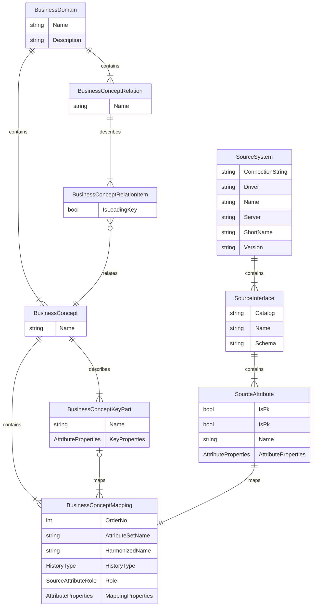
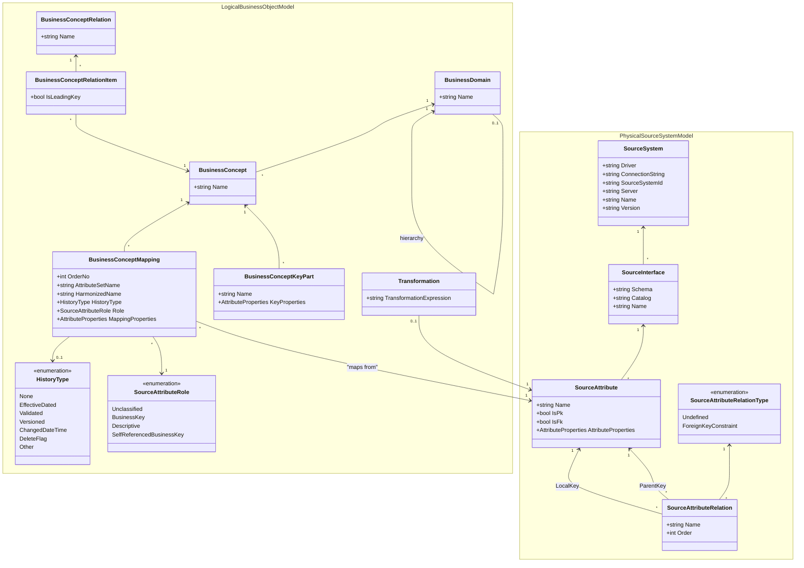

# DataSettMetamodel

The DataSettMetamodel project contains the core data models for the DataSett system, providing a comprehensive metamodel for business objects and their relationships to physical source systems.

## Overview

This project defines two main model categories:

1. **Logical Business Object Model** - Represents business concepts and their relationships
2. **Physical Source System Model** - Represents the actual data sources and their structure

## Architecture

### Base/DTO/Domain Pattern

The metamodel implements a clean separation pattern with three layers for each entity:

- **Base Classes** (`[EntityName]Base`) - Contain only scalar/context properties (Id, Name, timestamps, etc.)
- **DTO Classes** (`[EntityName]DTO`) - Inherit from base and add foreign key references for serialization
- **Domain Classes** (`[EntityName]`) - Inherit from base and add navigation properties and business logic

**Benefits:**
- Clean serialization to separate JSON files with ID references
- Clear separation of concerns
- Easy to test and maintain
- Supports complex object graphs without circular reference issues

**For detailed documentation, see:** [BASE_DTO_DOMAIN_PATTERN.md](BASE_DTO_DOMAIN_PATTERN.md)

### Layered Architecture

The metamodel follows a layered architecture where business concepts are mapped to physical data sources through attribute set mappings, enabling data integration and transformation scenarios.

## Entity Relationsships

## Class Structure

## Key Concepts
The key concept is to implement a clean seperation between the physical source system and the business object model.
This way parser for physical systems can be implemented independently from tools to harmonize these systems in a business model.

### Logical Business Object Model

- **BusinessDomain**: Represents a business domain that can contain business objects and relations. Supports hierarchical structure.
- **BusinessObject**: Represents a business entity with a collection of attribute sets.
- **AttributeSet**: Groups related attributes that belong to a business object.
- **BusinessConceptMapping**: Maps business attributes to physical source attributes, enabling data integration.
- **BusinessObjectRelation**: Defines relationships between business objects.
- **BusinessObjectRelationItem**: Represents individual items in a business object relationship.
- **HistoryType**: Defines how historical data should be handled.
- **Transformation**: Defines data transformations applied during mapping.

### Physical Source System Model

- **SourceSystem**: Represents a physical data source system with connection details.
- **SourceInterface**: Represents a data interface (table, view, etc.) within a source system.
- **SourceAttribute**: Represents individual attributes/columns in source interfaces.
- **SourceAttributeRelation**: Defines relationships between source attributes (foreign keys, etc.).
- **SourceAttributeRole**: Enumeration defining the role of source attributes in business context.
- **SourceAttributeRelationType**: Enumeration defining types of relationships between source attributes.

## Usage

This metamodel serves as the foundation for:

- Data modeling and business object definition
- Data source discovery and cataloging
- Data mapping and transformation definition
- Data lineage and impact analysis
- Metadata management and governance

## JSON Serialization

All classes are designed for JSON serialization using `System.Text.Json`. The [DataSettMetamodelSerde](../DataSettMetamodelSerde/README.md) library provides a shared `JsonSerializerOptions` instance (`JsonDefaults.Web`) that automatically converts PascalCase property names to camelCase in JSON output.

**Key Points:**
- Property naming is handled globally through `JsonDefaults.Web` options
- No `[JsonPropertyName]` attributes are needed on properties
- All JSON output uses consistent camelCase naming
- For detailed serialization information, see [DataSettMetamodelSerde/README.md](../DataSettMetamodelSerde/README.md)